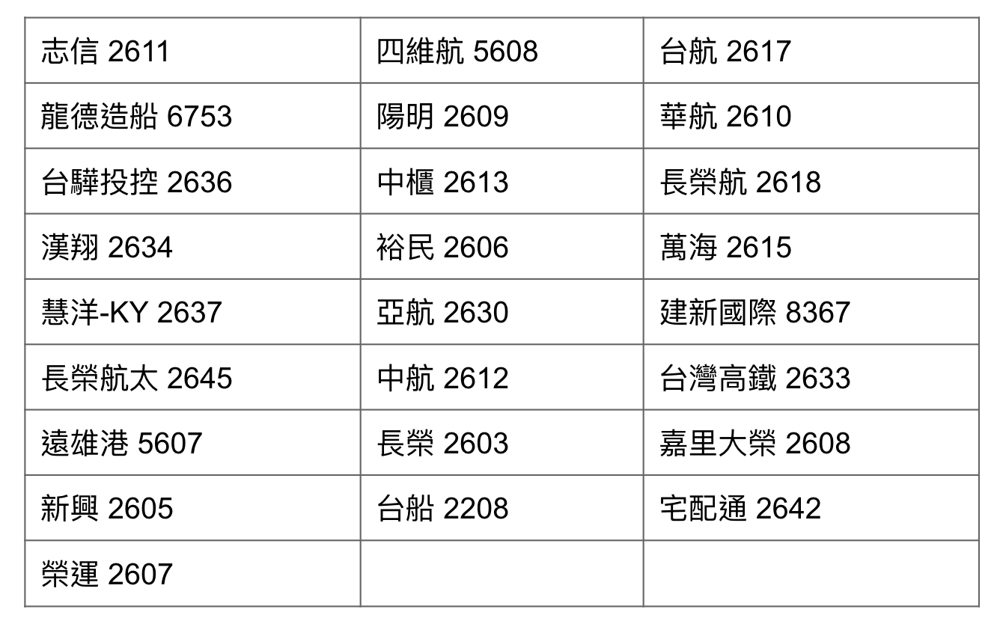
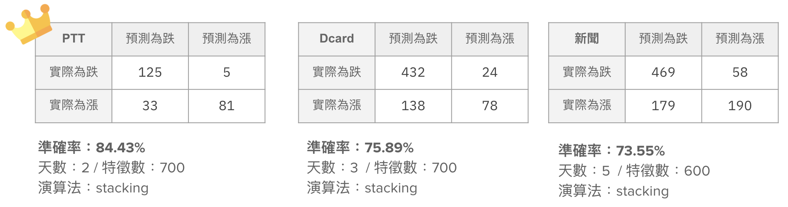
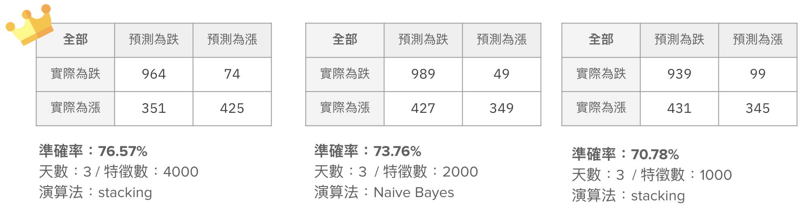
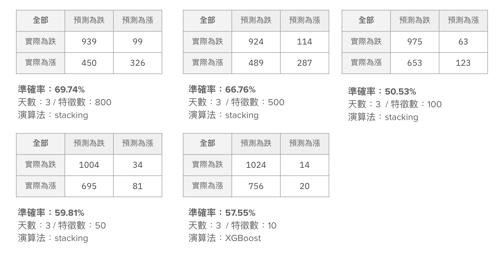
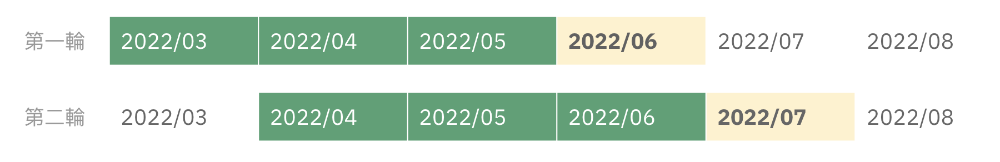
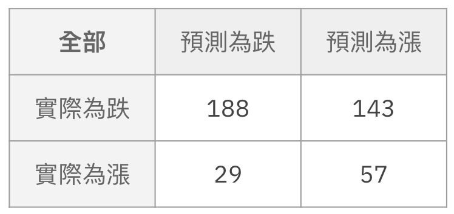
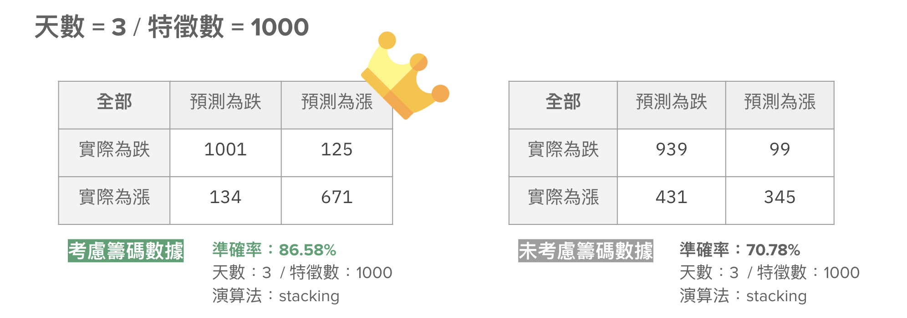

#                                用新聞與社群媒體數據預測航運股漲跌                        

> **112-2 大數據與商業分析 期中專案**
> 資管三 邱秉辰
> 工管三 蕭丞喨 彭靖淵 陳恩琦 林奕嫻 詹舒涵  

## 檔案架構

```
.
└── bda-midterm-project/
    ├── README.md # 本文件
    ├── codespace/ 
    │   ├── main.ipynb # 模型訓練的主要程式碼
    │   ├── chip.ipynb # 當初取得籌碼數據所使用的程式碼
    │   ├── filter.ipynb # 當初篩資料時所使用的程式碼
    │   ├── labeling.ipynb # 當初資料標記時所使用的程式碼
    │   ├── README.md
    │   └── archives/ 
    │       └── ... # 其他次要程式碼
    ├── assets/
    	└── ... # 本文件的圖檔存放處
    └── results/
        ├── model_training/
        │   ├── task1/
        │   │   └── ... # 不同內容種類間最佳模型之比較結果
        │   └── task2/
        │       └── ... # 所有內容在不同特徵數下之比較結果
        └── backtest/
            ├── best_model/ 
            │   └── ... # 在不同的特徵數下，各月的最佳模型與預測準確度資訊
            ├── predictions_by_date/
            │   └── ... # 以天為單位，預測分別為漲或跌或不出手的篇數
            └── final_rate/
                └── ... # 以月為單位，最終的出手率和準確率
```

## 專案摘要

### 資料篩選

我們選取了 [25 家台灣航運類上市公司](https://tw.stock.yahoo.com/class-quote?sectorId=20&exchange=TAI)作為分析對象。



進行缺失值處理前，若透過標題或內文包含公司名稱或「航運」兩字的標準篩選原資料集，可獲得：

- 新聞  8617 筆
- Dcard 6665 筆
- PTT 2013 筆

### 資料標記

#### 計算總體漲跌幅

某日的漲跌幅 = 各公司某日漲跌幅之加權平均

- 各公司某日漲跌幅 = (某日收盤價 - 前一日收盤價 / 前一日收盤價) ✕ 100%
- 此處的權重，指的是公司的市值 (某日收盤價 ✕ 流通股數)

#### 將文章標記成看漲或看跌

假設文章的刊登日期為 D，我們選定某個參數 n

- 若 D+n 天的漲幅大於 0.9%，標為看漲
- 若 D+n 天的跌幅大於 0.9%，標為看跌
- 若 D+n 天為休市日，則順延至離該天最近的開市日

### 資料前處理

#### 中文斷詞

- 使用工具：[CKIP Tagger](https://github.com/ckiplab/ckiptagger)
- 先對各篇文章進行斷詞，並且對裡面的每一個詞語進行[詞性標記](https://ckip.iis.sinica.edu.tw/CKIP/paper/poslist.pdf)
- 僅保留**普通名詞、動詞、形容詞**作後續的特徵選取使用


#### 建構向量空間

- 使用 [TfidfVectorizer](https://scikit-learn.org/stable/modules/generated/sklearn.feature_extraction.text.TfidfVectorizer.html) 建構詞彙的向量空間
  - 考慮 1-gram 至 3-gram 的詞彙組合
  - 篩選掉 df 大於文件數 95% 與出現小於 2 次的詞彙
- 藉由 [chi-square](https://scikit-learn.org/stable/modules/generated/sklearn.feature_selection.SelectKBest.html) 選出**前 k 名**的最佳特徵作為模型的輸入
  - 在模型訓練階段使用**不同的 k 值**進行實驗

### 模型訓練

#### 訓練流程

將資料隨機切分成**訓練資料集 (80%)** 與**測試資料集 (20%)**

- 對訓練資料集進行 5-fold cross validation
- 使用 NB, SVM, RF, XGB 與 stacking model 對測試資料進行預測
- 選擇準確率最高的模型


#### 不同內容種類間之比較

- 將不同內容種類 (ptt vs. dcard vs. 新聞) 的資料**分開討論**
- 考慮**不同的天數 (1 – 5)** 和**不同特徵數 (100 – 700)** 進行模型訓練
- 比較各種類最佳模型之預測結果



#### 所有資料之模型訓練

- 整合新聞、Dcard、PTT，使用**所有資料**
- 考慮 **天數 = 3** 時**不同特徵數 (10 – 4000)** 進行訓練
- 比較在不同特徵數下最佳模型的訓練結果





### 移動回測

#### 回測流程

- 使用**所有資料**
- 從 2022 年 3 月開始：
  - 取連續 **3 個月資料**進行模型訓練，並選取最佳模型
  - 用上述模型預測**第 4 個月**的股市漲跌
  - **往後移動 1 個月**，重複上述步驟



#### 回測結果

- **天數 = 3 / 特徵數 = 500**

- 每天票數相同時不出手
- 總出手率：96.08% / 總準確率：58.75%




### 進階討論：使用籌碼數據

#### 動機

- 對三大法人買賣超進行探索性資料分析後，發現其對於漲跌有不錯的預測。
- 且籌碼面確實公認會對於市場有引導的效果。

#### 模型訓練結果之比較



#### 回測結果之比較

- **天數 = 3 / 特徵數 = 500**

- 每天票數相同時不出手
- 總出手率：97%  / 總準確率：60.1%
  - 僅微幅增加 1.35%

### 研究限制與展望

- 因為訓練模型需要耗費龐大的時間成本，無法對所有參數組合進行實驗
- 目前在斷詞的部分，僅有保留**普通名詞、動詞、形容詞**，會不會有更好的選取方法？
- 各月資料分布不平均，難以單獨對不同內容種類進行回測
- 可以納入更多的特徵，譬如該篇文章的情感值等等

